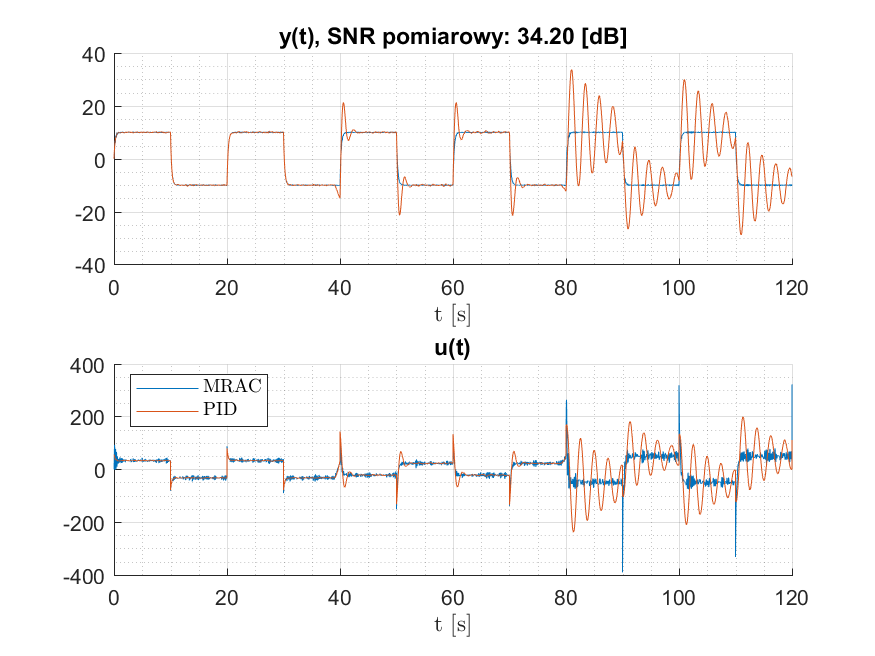

# uz-BSc-dMRAC

* Comparison of direct MRAC scheme vs PID with constant gains
* Based on: Petros A. Ioannou and Jing Sun. Robust Adaptive Control. Prentice Hall, Inc,
University of Southern California, Los Angeles, 1996

